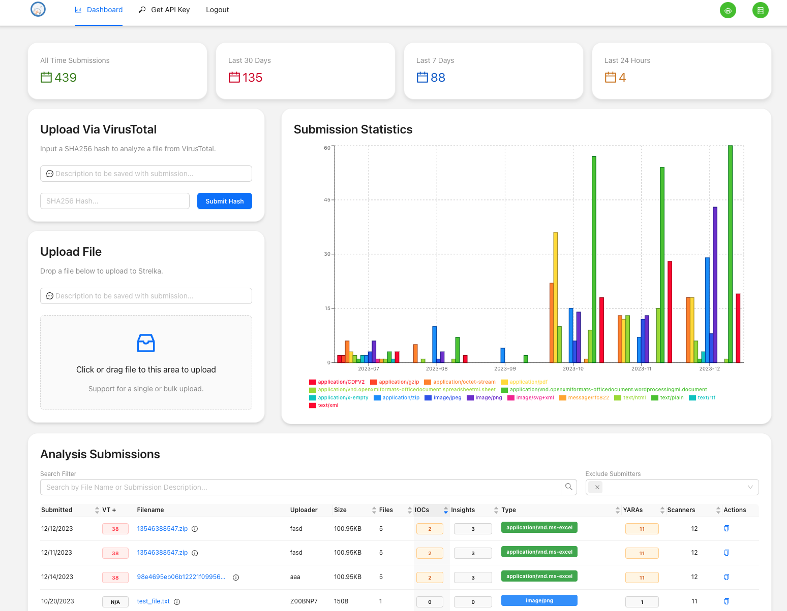

<h1 align="center">
  
</h1>

<div align="center">

[Releases][release]&nbsp;&nbsp;&nbsp;|&nbsp;&nbsp;&nbsp;[Pull Requests][pr]&nbsp;&nbsp;&nbsp;|&nbsp;&nbsp;&nbsp;[Issues][issues]

[![GitHub release][img-version-badge]][repo] [![Build Status][img-actions-badge]][actions-ci] [![Pull Requests][img-pr-badge]][pr] [![Slack][img-slack-badge]][slack]  [![License][img-license-badge]][license]

</div>

The Strelka Web UI is a browser / API based file submission frontend for the [Strelka Enterprise File Scanner](https://github.com/target/strelka). This application allows users to easily submit files to a Strelka cluster and review historical response results.

<div align="center">
  
  <h5>Strelka UI Results Page</h5>
</div>

## Features
The file submission UI provides the following features:
* Submit files to a Strelka cluster and examine responses from your browser.
* Store and review previous submission results and activity in either a local or remote database.
* Support for [LDAP Authentication](https://ldap.com/)

## Prerequisites
- Accessible Strelka instance (See: [Strelka Quickstart](https://github.com/target/strelka#quickstart))
- docker
- docker-compose
- python 3.6+

## Quick Start
By default, the Strelka UI is configured to use a minimal "quickstart" deployment that allows users to test the system. This deployment will target a local Strelka instance and start a local database. Users will be able to access this system with whatever username / password they want. For additional information on targeting a remote Strelka instance, database, or using LDAP for authentication, see the [Additional Setup](#quick-start) section:

#### Step 0: Ensure a Strelka Cluster is Ready
```
Start or ensure Strelka cluster is ready and accessible.
See https://github.com/target/strelka for more information.
```

#### Step 1: Build and Start Strelka UI (Docker)
```
# Terminal 1
# From the ./strelka-ui directory
$ docker-compose -f docker-compose.yaml up
```

#### Step 3: Access Strelka UI
```
1) Open A Browser
2) Navigate to 0.0.0.0:8080
3) Login with:
    - Username: strelka
    - Password: strelka
```    

## Additional Steps
This section provides details on how to target a remote Strelka instance, a remote database for storage, and an LDAP server for authentication for more secure use. To enable these, you can use environment variables to override the defaults.

#### Environment Variable Configuration
Backend configuration is provided through environment variables and can be set statically in `config.py`.

Running locally, the precedence of config is: `System environment -> .env -> config.py`.
Running in Docker, the precedence of config is: `Docker environment -> System environment -> config.py`.

Please reference `./app/example.env` for environment variable setup.

#### Environment Variable Options
```
# Strelka connection information (OPTIONAL / HAS DEFAULTS).
STRELKA_HOST=<Strelka Hostname
STRELKA_PORT=<Strelka Port>
STRELKA_CERT=<Path to Certificate for Strelka (If needed)

# LDAP URL and credentials for search-bind auth (OPTIONAL).
LDAP_URL=<URL to LDAP Server>
CA_CERT_PATH=<Path To CA Certificates For LDAP>

# Folder where the build react app is served from  (OPTIONAL / HAS DEFAULTS).
# Requires the front end to be built (i.e. from /ui, run `npm run build`)
STATIC_ASSET_FOLDER=<Build Folder for UI>

# Folder where the alembic migrations live  (OPTIONAL / HAS DEFAULTS).
MIGRATION_DIRECTORY=<SQLAlchemy Migrations Directory>

# Database configuration (REQUIRED / HAS DEFAULTS FOR LOCAL COMPOSE CLUSTER ONLY). 
DATABASE_USERNAME=<Database User Name>
DATABASE_PASSWORD=<Database User Password>
DATABASE_HOST=<Database Hostname>
DATABASE_PORT=<Database Port>
DATABASE_DBNAME=<Name of Database>
```

## API
The Strelka UI also provides API routes for user script based access. Please reference the below routes for details:

#### Authentication routes 
- [base url]/api/auth/login (POST)
- [base url]/api/auth/logout (GET)

#### Strelka routes
- [base url]/api/strelka/scans/stats (GET)
- [base url]/api/strelka/scans/upload (POST, form-encoded)
- [base url]/api/strelka/scans?page=?&per_page=? (GET)
- [base url]/api/strelka/scans/[scan id] (GET)

## Database
The database uses [https://www.sqlalchemy.org/](SQLAlchemy) as an ORM. [Flask-Migrate](https://flask-migrate.readthedocs.io/en/latest/) is used to provide db migrations though Alembic. A helper script file, `manage.py`, is provided to assist with common database tasks. 

If you are creating a new database, or modifying the current one, you must perform the following steps - although upon starting the cluster, these commands will be executed for you:

Generate a new migration from model changes:
- python manage.py db migrate 

Update the database using the current database configuration
- python manage.py db upgrade

## Application Details
The backend application is predominantly comprised of the following technologies:
- [https://flask.palletsprojects.com/en/1.1.x/](Flask) 
- [https://www.sqlalchemy.org/](SQLAlchemy) 
- [https://www.postgresql.org/](PostgreSQL)

The frontend UI is a React JS application created using React served from Flask. The UI uses the `Antd` library and `Antd ProComponents`, and routing is handled by React Router.
- [create-react-app](https://github.com/facebook/create-react-app)
- [Ant Financial UI](https://ant.design/)
- [Antd ProComponents](https://procomponents.ant.design/)
- [React Router](https://reactrouter.com/web/)

<div align="center">
  
  <h5>Strelka UI Dashboard Page</h5>
</div>

## Related Projects
* [Strelka](https://github.com/target/strelka)

## Licensing
Strelka UI and its associated code is released under the terms of the [Apache 2.0 License](https://github.com/target/strelka-ui/blob/master/LICENSE).


<div align="center">
  
</div>

<!--
Links
-->
[release]:https://github.com/target/strelka-ui/releases/latest "Strelka UI Latest Release"
[issues]:https://github.com/target/strelka-ui/issues "Strelka UI Issues"
[pull-requests]:https://github.com/target/strelka-ui/pulls "Strelka UI Pull Requests"
[repo]:https://github.com/target/strelka-ui "Strelka UI Repository"
[slack]:https://join.slack.com/t/cfc-open-source/shared_invite/zt-e54crchh-a6x4iDy18D5lVwFKQoEeEQ "Slack (external link)"
[actions-ci]:https://github.com/target/strelka-ui/actions/workflows/build_strelkaui_daily.yml "Github Actions"
[pr]:https://github.com/target/strelka-ui/pulls "Strelka UI Pull Requests"
[license]:https://github.com/target/strelka-ui/blob/master/LICENSE "Strelka UI License File"
[docker]:https://www.docker.com/ "Docker (external link)"

<!--
Badges
-->
[img-version-badge]:https://img.shields.io/github/release/target/strelka-ui.svg?style=for-the-badge
[img-actions-badge]:https://img.shields.io/github/workflow/status/target/strelka/Daily%20Build?&style=for-the-badge
[img-slack-badge]:https://img.shields.io/badge/slack-join-red.svg?style=for-the-badge&logo=slack
[img-pr-badge]:https://img.shields.io/badge/PRs-welcome-orange.svg?style=for-the-badge&logo=data%3Aimage%2Fsvg%2Bxml%3Bbase64%2CPD94bWwgdmVyc2lvbj0iMS4wIiBlbmNvZGluZz0iVVRGLTgiPz48c3ZnIGlkPSJzdmcyIiB3aWR0aD0iNjQ1IiBoZWlnaHQ9IjU4NSIgdmVyc2lvbj0iMS4wIiB4bWxucz0iaHR0cDovL3d3dy53My5vcmcvMjAwMC9zdmciPiA8ZyBpZD0ibGF5ZXIxIj4gIDxwYXRoIGlkPSJwYXRoMjQxNyIgZD0ibTI5Ny4zIDU1MC44N2MtMTMuNzc1LTE1LjQzNi00OC4xNzEtNDUuNTMtNzYuNDM1LTY2Ljg3NC04My43NDQtNjMuMjQyLTk1LjE0Mi03Mi4zOTQtMTI5LjE0LTEwMy43LTYyLjY4NS01Ny43Mi04OS4zMDYtMTE1LjcxLTg5LjIxNC0xOTQuMzQgMC4wNDQ1MTItMzguMzg0IDIuNjYwOC01My4xNzIgMTMuNDEtNzUuNzk3IDE4LjIzNy0zOC4zODYgNDUuMS02Ni45MDkgNzkuNDQ1LTg0LjM1NSAyNC4zMjUtMTIuMzU2IDM2LjMyMy0xNy44NDUgNzYuOTQ0LTE4LjA3IDQyLjQ5My0wLjIzNDgzIDUxLjQzOSA0LjcxOTcgNzYuNDM1IDE4LjQ1MiAzMC40MjUgMTYuNzE0IDYxLjc0IDUyLjQzNiA2OC4yMTMgNzcuODExbDMuOTk4MSAxNS42NzIgOS44NTk2LTIxLjU4NWM1NS43MTYtMTIxLjk3IDIzMy42LTEyMC4xNSAyOTUuNSAzLjAzMTYgMTkuNjM4IDM5LjA3NiAyMS43OTQgMTIyLjUxIDQuMzgwMSAxNjkuNTEtMjIuNzE1IDYxLjMwOS02NS4zOCAxMDguMDUtMTY0LjAxIDE3OS42OC02NC42ODEgNDYuOTc0LTEzNy44OCAxMTguMDUtMTQyLjk4IDEyOC4wMy01LjkxNTUgMTEuNTg4LTAuMjgyMTYgMS44MTU5LTI2LjQwOC0yNy40NjF6IiBmaWxsPSIjZGQ1MDRmIi8%2BIDwvZz48L3N2Zz4%3D
[img-license-badge]:https://img.shields.io/badge/license-apache-ff69b4.svg?style=for-the-badge&logo=apache
[img-docker-badge]:https://img.shields.io/badge/Supports-Docker-yellow.svg?style=for-the-badge&logo=docker
